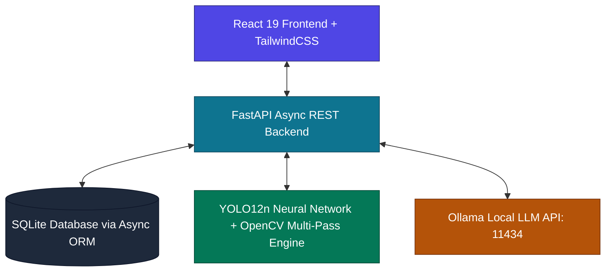

# 🚀 Enterprise Technical Interview Preparation Guide: Multimodal Vision-LLM & AI-ERP

This guide outlines your preparation strategy, key talking points, and slides/walkthrough structure for technical interviews. It highlights **SmartFactory AI-ERP & Multimodal Vision Inspector** (the software you developed) and showcases how classic Computer Vision (YOLOv8, OpenCV) combined with Generative AI (Vision-Language Models / LLMs) bridges traditional detection and intelligent multimodal reasoning.

---

## 📅 Part 1: Presentation Structure & Slides Outline

HR requested a presentation covering:
1. **Software Developed**: *SmartFactory AI-ERP* (running live on your laptop).
2. **AI Presentation**: *Improving Human Efficiency for Garments Sourcing*.

### Slide 1: Title Slide
* **Title**: SmartFactory AI-ERP: Cognitive Automation for Apparel Sourcing & QC
* **Sub-title**: Elevating Human Efficiency & Sourcing Precision with Local AI & Computer Vision
* **Presenter**: Abdul Mazid (Software Engineer)

### Slide 2: The Core Challenge in Garment Buying Houses
* **The Sourcing Bottleneck**: Merchandisers spend 40% of their time on manual, repetitive tasks: copying Tech Pack data into ERPs, drafting RFQs, tracking shipments across disparate portals, and auditing paper-based QC sheets.
* **The Quality Control Risk**: Visual fabric defects (stains, holes, edge density tears) slip through manual inspection, leading to expensive buyer-end rejections.
* **The Solution**: **SmartFactory AI-ERP** — an integrated ecosystem running local, zero-cloud dependency AI models (YOLO12 + local LLMs) directly at the Dhaka facility.

### Slide 3: SmartFactory System Architecture

* **Security First**: 100% local deployment. Sourcing and buyer Tech Packs (IP-sensitive data) are processed locally without exposure to third-party public clouds.

### Slide 4: Live Software Demo — Step-by-Step
*(Open your browser at `http://localhost:5173` and walk the board through the following features)*:
1. **AI Tech Pack Assistant**: 
   * *Action*: Paste raw tech pack text (e.g. Zara Denim Jacket) and click "Ingest".
   * *Value Proposition*: Shows local LLM (`openchat:latest`) parsing unstructured technical text into a structured JSON Bill of Materials (BOM) in seconds.
   * *Efficiency Boost*: Cuts manual database entry time from hours to under 30 seconds.
2. **Quality Control Vision Workbench**: 
   * *Action*: Upload a fabric sample image and trigger a scan.
   * *Value Proposition*: Shows the dual-engine pipeline: OpenCV multi-pass algorithms (detecting edge density, bright/dark stains, texture variance) combined with a local YOLO12 neural network (`yolo12n.pt`).
   * *Efficiency Boost*: Automates visual audits, generating structured QA compliance logs committed straight to the database.
3. **Supply Chain Disruption Analytics**: 
   * *Action*: Select a PO, enter a disruption vector (e.g., "Chittagong port strike"), and generate a mitigation plan.
   * *Value Proposition*: Predicts updated delay probabilities and drafts structured recovery suggestions.

---

## 💡 Part 2: AI Presentation — Improving Sourcing Efficiency

Use these key pillars to explain how emerging AI technologies can improve human operational efficiency:

| Sourcing Operation | Traditional Human Workflow | AI-Enabled Efficiency | Human Efficiency Gains |
| :--- | :--- | :--- | :--- |
| **Tech Pack & BOM Ingestion** | Merchandiser manually extracts material lists, buttons, and zippers, and types them into the ERP. | **Local LLM Parsers** extract details and map them to standard inventory codes automatically. | **90% time reduction** (from ~2 hours per style to 1 minute). |
| **Vendor RFQ Issuance** | Manually compiling emails, copy-pasting tables, and chasing up suppliers. | **Generative RFQ Engines** generate custom formal RFQs (incorporating MOQ, lead times, and FOB clauses) instantly. | **75% reduction** in procurement cycles. |
| **Fabric Inspection (QC)** | Manual audit rolls. Quality inspectors physically examine fabric under lightboxes. | **YOLO12 Computer Vision** flags defect spots on camera feeds in real-time, highlighting them for physical review. | **50% increase** in inspection speed; near-zero human error. |
| **Shipment Tracking & Risk Management** | Proactively checking carrier sites; reacting to shipping delays *after* they occur. | **Predictive Logistics Risk Assessment** calculates delay probabilities and auto-drafts alternate route recommendations. | Prevents cargo bottlenecking, saving thousands in air-freight penalties. |

---

## 🛠 Part 3: Technical Q&A Preparation for the Interview Board

Be ready to deep-dive into the engineering choices you made when developing **SmartFactory AI-ERP**:

### 1. "Why did you choose FastAPI for the backend instead of Flask or Django?"
* **Answer**: "FastAPI provides native asynchronous support (using Python's `async/await`), which is crucial for handling concurrently executing AI tasks (such as background OpenCV processing and long-running local LLM requests). It also utilizes Pydantic v2 for automatic, high-performance data serialization, and auto-generates interactive Swagger API documentation at `/docs`."

### 2. "How does your dual-engine computer vision QC pipeline work?"
* **Answer**: "It combines deep learning with classical computer vision for maximum reliability:
  * **OpenCV Engine (Multi-Pass)**: Handles structural defects. *Pass 1 (Dark Blob)* uses binary thresholding to detect stains/holes. *Pass 2 (Bright Blob)* detects over-tension or bleach spots. *Pass 3 (Edge Density)* maps Canny edges on an 8x8 grid to catch snags and tears. *Pass 4 (Texture Variance)* checks local standard deviation to flag pilling.
  * **YOLO12 Neural Network**: Trained on fabric defect datasets, acts as a secondary verification pass. 
  * We perform **Non-Maximum Suppression (NMS)** to deduplicate overlaps and output final bounding boxes and severity scores."

### 3. "How did you ensure the LLM outputs stable JSON when interacting with the database?"
* **Answer**: "This is a classic problem in Generative AI systems. I resolved it in two ways:
  1. **Strict Prompt Constraint**: In `ai_service.py`, the prompt explicitly defines the target JSON schema and instructs the LLM to output only raw JSON without markdown fences.
  2. **Defensive Parsing & Sanitization**: The backend extracts the output, uses regular expressions to strip any code block fences (e.g. ````json ... ````), parses it defensively within a `try-except` block, and validates required keys. If the parse fails, the service falls back to safe mock values to prevent a 500 error."

### 4. "How did you handle the async database operations?"
* **Answer**: "I used **SQLAlchemy**'s async extension with the **aiosqlite** driver. This keeps the database operations fully non-blocking, so a slow query or heavy insert operation doesn't lock the thread pool while handling concurrent API traffic."

### 5. "Why do we need this AI software when our merchandisers and QA inspectors already have BSc, MSc, or Textile Engineering degrees and know this sector?"
* **Answer**: "Degrees (BSc/MSc) give our team members **high-level critical thinking, styling expertise, and negotiation skills**. However, a degree does not protect them from manual, repetitive administrative friction and biological fatigue:
  1. **Leveraging Expertise over Data Entry**: An MSc-educated merchandiser knows textile science, but they still have to spend 1-2 hours manually copying and typing a 50-item BOM from a PDF Tech Pack into a database. AI parses it in 5 seconds. This frees up the highly qualified merchandiser to focus on what their degree actually prepared them for: finding better fabrics, negotiating prices, and building buyer relationships.
  2. **Solving Mental/Physical Fatigue in QC**: A QA inspector with a Textile degree knows what fabric defects look like, but visually scanning thousands of meters of fabric moving at high speeds is exhausting. After 4-6 hours, human focus drops, and defects slip through. The OpenCV + YOLO12 AI vision engine monitors the feed with 100% consistent attention 24/7. It alerts the inspector to specific coordinates, acting as an 'AI co-pilot' to eliminate error.
  3. **Cognitive Scale (Proactive vs. Reactive)**: Knowing shipping logistics doesn't give a human the ability to monitor real-time port logs, weather datasets, and carrier performance variables simultaneously. The AI processes these metrics in real-time, predicting logistics risks before cargo leaves the port, allowing our team to act proactively rather than reacting after cargo is delayed.

### 6. "Can you explain your Multimodal Vision-LLM Assistant (CV + GenAI) architecture?"
* **Answer**: "Yes! This architecture bridges classic Computer Vision with modern Generative AI:
  1. **Spatial Object Detection & Cropping (YOLOv8 + OpenCV)**: The classical/deep learning engine first scans the full image or document frame to locate bounding boxes `[x1, y1, x2, y2]` of interest (e.g. equipment damage, document elements, or textile defects). It crops these specific region patches using OpenCV (`img[y1:y2, x1:x2]`) and encodes them as base64 byte streams.
  2. **Multimodal Reasoning (Vision-Language Models)**: The cropped region patches are fed alongside structured prompt metadata into a Vision-Language Model (such as **Qwen2-VL**, **LLaVA**, or **Gemini Vision**).
  3. **Diagnostic Synthesis**: Rather than giving simple label strings like 'defect', the Vision-LLM evaluates spatial anomalies, visual textures, and contextual intent to synthesize a full diagnostic report detailing visual signatures, root cause hypotheses, severity scores, and corrective remediation steps.""

---

## 🎯 Part 4: Matching Your Skills to the Job Description

During the interview, map your experience with **SmartFactory** to their specific requirements:

* **ERP Development & Customization**: "I developed a multi-module FastAPI-React ERP featuring Order Management, Procurement, Inventory, and Production Tracking connected to an SQLite relational database."
* **Buying House Context**: "SmartFactory was designed specifically for buying houses to solve the problem of manual Tech Pack entry and vendor-supplier matching (merchandiser-to-supplier RFQ automation)."
* **AI/ML & Business Automation**: "Demonstrated via local YOLO12 fabric defect detection, automated QA audits, and LLM-powered supply chain mitigation workflows."
* **Integration**: "Seamless integration of third-party vision libraries (Ultralytics YOLO, OpenCV), local inference engines (Ollama), FastAPI, and modern single-page-application state management (React 19 + Axios)."

---

## 💡 Quick Tips for the Interview Day

1. **Prerequisites Check**: Ensure your local Ollama server is running (`ollama run openchat`) and that the FastAPI backend (`uvicorn main:app` at port 8000) and React frontend (`npm run dev` at port 5173) are active before walking into the interview board.
2. **Bring a Fabric Sample Image**: Have a sample fabric image ready on your desktop to upload to the QC Vision tab.
3. **Pace Your Presentation**: Start with the business problem (why merchandisers are slow), show how the software solves it, and then explain *how* you built it technically.

---

## 📖 Glossary: RMG & Tech Acronym Cheat Sheet

Use this quick guide to understand all the short forms (abbreviations) used throughout the SmartFactory codebase and the Ready-Made Garments (RMG) industry:

### 👔 Garment Industry Acronyms (RMG Domain)

| Acronym | Full Form | What it means in simple terms |
| :--- | :--- | :--- |
| **RMG** | **R**eady-**M**ade **G**arments | Factory-made clothing (mass-produced clothes) sold to retail brands. |
| **BOM** | **B**ill **o**f **M**aterials | The **recipe list** of raw materials (fabric, zippers, buttons) needed for a garment. |
| **Tech Pack**| **Tech**nical **Pack**age | The **design blueprint** sheet containing drawings, sizes, and BOM sent by the brand. |
| **RFQ** | **R**equest **f**or **Q**uotation | An email/form asking suppliers: *"How much do your materials cost, and how fast can you send them?"* |
| **PO** | **P**urchase **O**rder | The **official order contract** sent to a factory to start production. |
| **QC** | **Q**uality **C**ontrol | Inspecting the fabric or finished garments to find defects (stains, holes, tears). |
| **AQL** | **A**cceptable **Q**uality **L**imit | The maximum number of defect garments allowed in a batch before rejecting it. |
| **FOB** | **F**ree **o**n **B**oard | Shipping term: supplier pays costs up to the local port (e.g. Chittagong); buyer handles the cargo vessel. |
| **MOQ** | **M**inimum **O**rder **Q**uantity | The smallest amount of items a supplier is willing to sell (e.g., must order at least 500 zippers). |
| **ETA** | **E**stimated **T**ime of **A**rrival | The date when raw materials or finished shipments are expected to arrive. |

---

### 💻 Technical Acronyms (Software & AI Domain)

| Acronym | Full Form | What it means in simple terms |
| :--- | :--- | :--- |
| **ERP** | **E**nterprise **R**esource **P**lanning | The central database software that runs the entire business operations. |
| **LLM** | **L**arge **L**anguage **M**odel | AI models like ChatGPT or OpenChat that can read and write human language. |
| **YOLO** | **Y**ou **O**nly **L**ook **O**nce | A super-fast computer vision AI model used to spot and label defects in images. |
| **RAG** | **R**etrieval-**A**ugmented **G**eneration | Feeding company documents (PDFs/spreadsheets) into an LLM so it can answer questions based on your files. |
| **ORM** | **O**bject-**R**elational **M**apping | A code library (like SQLAlchemy) that lets you talk to your database using Python instead of raw SQL. |
| **NMS** | **N**on-**M**aximum **S**uppression | A cleanup algorithm used in vision AI to remove overlapping boxes and keep only the single best box for a defect. |

---

## 🧪 Live Demo Script: Testing the AI Tech Pack Assistant in the Interview

To demonstrate this feature to the interview board live, follow these steps:

### Step 1: Open the Application
1. Start the backend: `.venv\Scripts\python main.py` (runs at `http://localhost:8000`).
2. Start the frontend: `npm run dev` (runs at `http://localhost:5173`).
3. Open your browser and navigate to `http://localhost:5173`.
4. Click on the **AI Tech Pack Assistant** tab on the left sidebar.

### Step 2: Copy-Paste the Sample Tech Pack Text
Copy the following unstructured spec sheet text and paste it into the **Input Buyer Tech Pack Text** box:

```text
TECH PACK SPECIFICATION SHEET
Style Reference: PO-9021
Buyer Reference: ZARA International
Sourcing Contact: sourcing@zara.com
Garment Type: Heavy Wash Denim Jacket
Quantity Ordered: 1200.0 pcs

BILL OF MATERIALS (BOM) DETAILS:
- denim fabric: 2400.0 meters
- brass buttons: 12000.0 pieces
- zippers: 1200.0 pieces

Special Instructions: All stitching should use polyester contrast thread. Wash treatment: Stone wash with enzyme softening.
```

### Step 3: Run the Ingestion
1. Click the **⚡ Ingest & Parse Tech Pack** button.
2. **Watch the Magic Happen:**
   * **Extracted Data:** The AI will extract structural fields from the unstructured text and display the parsed JSON (Order ID, Buyer, Quantities, and the BOM list).
   * **Automated Database Creation:** In the background, the app creates a new Purchase Order (`PO-9021`), registers the Buyer profile, creates the Bill of Materials list, and adds these materials to your warehouse stock.
   * **Automated RFQ Email Draft:** Look at the right side of the screen; the AI has drafted a complete, professional vendor RFQ email detailing itemized tables, payment terms (30% TT advance, 70% B/L copy), and delivery Incoterms (FOB Chittagong).

### Step 4: Verify the Database Update
1. Navigate to the **Order Management** tab on the left sidebar. You will see that **PO-9021** has been automatically added to the order tracking grid with a "Pending" status.
2. Navigate to the **Inventory & Safety** tab on the left sidebar. You will see that your warehouse stock count for `denim fabric` (+2,400m), `brass buttons` (+12,000 pcs), and `zippers` (+1,200 pcs) has increased automatically.


---

## 🎭 End-to-End Persona Scenario: Client vs. Merchandiser

To make your presentation highly engaging, walk the board through this realistic operational story:

### 👤 Part A: If You Are the Client (The Buyer - e.g., Zara Sourcing Manager)

**What you do:** You design a new apparel collection and send an order request to the sourcing team.
**What you provide (The Input):** You send a **Tech Pack** email. It is often unstructured, written in plain text, or sent as a PDF attachment.

*   **Example Client Tech Pack email content:**
    > *"Hi Sourcing team, we want to place an order for 2,000 units of our new 'Mens Slim Fit Jeans' (Order ID: PO-9988). The contact person is procurement@zara.com. For each pair of jeans, we require 1.5 meters of blue denim fabric, 1 metal zipper, and 5 brass rivets/buttons. Please send us a quote for this order as soon as possible."*

---

### 👤 Part B: If You Are the Merchandiser / Quality Manager

**What you do:** You receive the client's email. Instead of spending 1 hour manually calculating material requirements and typing them into spreadsheet databases, you use the AI-ERP platform.

#### Step 1: Automated Ingestion
*   You copy the client's raw email text and paste it into the **AI Tech Pack Assistant**.
*   You click **Ingest**.
*   The AI instantly translates the email into:
    *   **Total Materials Needed:** denim fabric (3,000 meters), zippers (2,000 pieces), brass buttons (10,000 pieces).
    *   **Database Record:** Automatically registers the buyer profile, creates `PO-9988`, and logs the Bill of Materials (BOM) list.

#### Step 2: Sourcing Materials (RFQ Generator)
*   You need to buy the materials. You switch to the **AI RFQ Generator** tab.
*   You select your trusted supplier (e.g. *Global Trim Solutions*) from the dropdown and click **Draft AI RFQ Email**.
*   The AI automatically generates a professional email requesting quotes for 2,000 zippers and 10,000 brass buttons, complete with standard buying terms (FOB, payment schedules, and lead times).

#### Step 3: Production and Quality Control (QC)
*   Once the supplier sends the materials to the Dhaka factory, you need to ensure quality.
*   The factory inspectors upload a photo of the fabric rolls to the **QC Vision Workbench**.
*   The system scans it and spots if there are any fabric stains or snags. If it detects a critical tear, the system marks the log as `Failed`, automatically warning you to reject the fabric roll and hold production before cutting, protecting the client's quality.

#### Step 4: Tracking & Shipping
*   You manage the logistics. If a carrier reports port delays, you use the **Logistics Tracking** tab to generate a risk-mitigation plan, ensuring the shipment arrives on time in Spain for the client.
